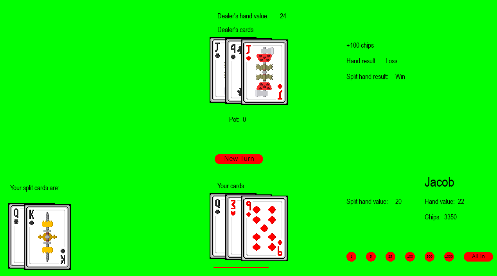

# Pygame Blackjack

Welcome to my Blackjack game! Built in Python (using Pygame), this game allows you to play Blackjack anywhere! This includes splitting (up to 3 times), doubling down, insurance, and late surrender.

## Rules/Features
- **6 Decks of cards:** 6 Decks of cards are in play. 
- **Hand Splitting:** If you have two of the same card (ex. two sevens, suit does not matter) in your hand, you can split them up. This creates two separate hands. The second hand must have the same amount bet on it as the original hand. If you are splitting Aces, you are automatically dealt only one additional card and then must stand.
Blackjacks that occur in split hands only payout twice the amount bet instead of the usual 2.5 multiplier. 
- **Doubling Down:** If the first two cards you are dealt total 9, 10, or 11, you can double down. This doubles your original bet. You are dealt only one additional card, and  must stand. Standard hand scoring then applies.
- For additional information on Blackjack rules, 

## Future Plans - Training a Blackjack AI Using Pytorch
I am currently working on training an AI to play my Blackjack game using Pytorch. The goal is to see if the AI will be able to replicate  on its own.

## How to Play

To run this project on your local machine, follow the following steps:
 

#### Clone the repository to your local machine

For instructions on cloning a repository, [click here.](https://docs.github.com/en/repositories/creating-and-managing-repositories/cloning-a-repository)

 

#### Open the blackjack.py file, and run it.
The program should appear in a separate window. 
- You will be prompted to enter in a username. Type in your username, and then press Enter. The game will then start.
